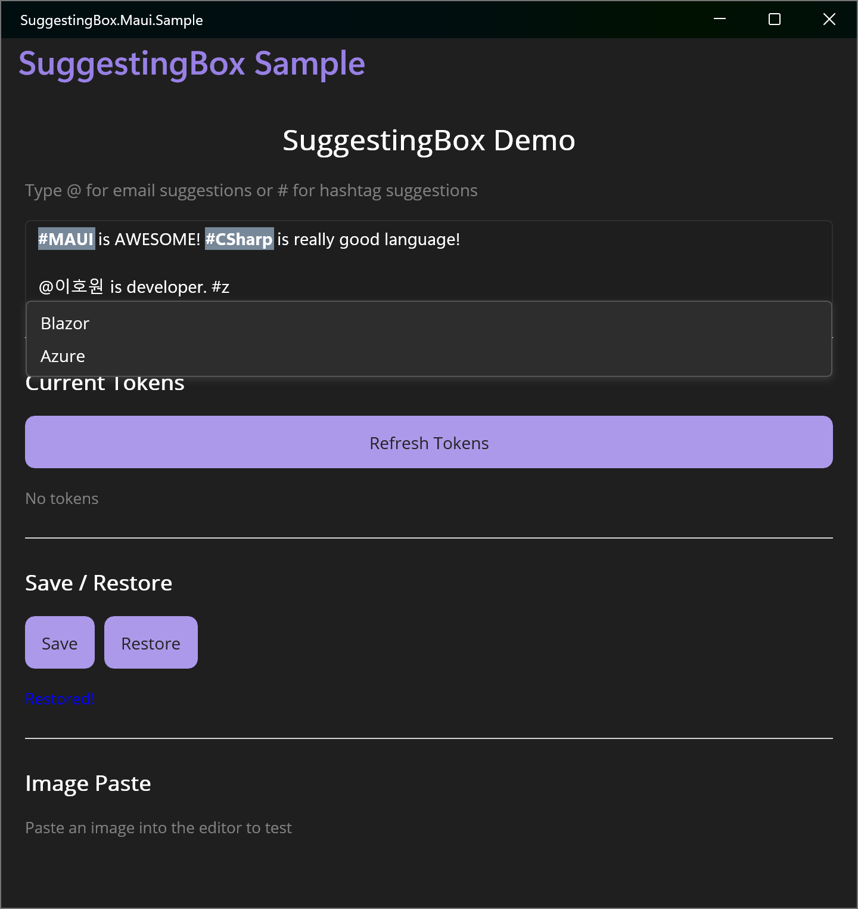

# SuggestingBox.Maui

[](https://www.nuget.org/packages/SuggestingBox.Maui) [](https://www.nuget.org/packages/SuggestingBox.Maui)

🌐 [English](README.md)

.NET MAUI용 인라인 멘션/태그 제안 컨트롤입니다. 접두 문자(예: `@`, `#`)를 입력하면 제안 팝업이 나타나고, 선택한 항목은 서식이 적용된 불변 토큰으로 에디터에 삽입됩니다.

## 📷 Showcase



## 기능

- **접두 문자 기반 제안** — 하나 이상의 트리거 문자(예: `@`, `#`)를 설정하여 제안 팝업을 활성화합니다.
- **서식 토큰** — 선택된 제안은 배경색, 글자색, 굵기를 커스터마이징할 수 있는 스타일 토큰이 됩니다.
- **토큰 원자적 동작** — 토큰은 불변 단위로 동작합니다. 커서가 토큰을 건너뛰고, 삭제 시 토큰 전체가 제거됩니다.
- **토큰 추출 및 복원** — `GetTokens()`와 `SetContent()`를 사용하여 토큰을 포함한 에디터 상태를 직렬화/역직렬화할 수 있습니다.
- **이미지 붙여넣기 감지** — 에디터에 이미지가 붙여넣어지면 `ImageInserted` 이벤트가 발생합니다.
- **크로스 플랫폼** — Android, iOS, macOS Catalyst, Windows를 지원합니다.

## 지원 플랫폼

| 플랫폼 | 최소 버전 |
|---|---|
| Android | 21.0 |
| iOS | 15.0 |
| macOS Catalyst | 15.0 |
| Windows | 10.0.17763.0 |

## 시작하기

### 1. 핸들러 등록

`MauiProgram.cs`에서:

```csharp
builder.UseMauiApp<App>()
       .UseSuggestingBox();
```

### 2. XAML에 추가

```xml
xmlns:suggestingBox="clr-namespace:SuggestingBox.Maui;assembly=SuggestingBox.Maui"

<suggestingBox:SuggestingBox
    x:Name="SuggestingBoxControl"
    Prefixes="@#"
    Placeholder="@나 #을 입력하여 멘션..."
    MaxSuggestionHeight="200">
    <suggestingBox:SuggestingBox.ItemTemplate>
        <DataTemplate>
            <VerticalStackLayout Padding="8,4">
                <Label Text="{Binding .}" />
            </VerticalStackLayout>
        </DataTemplate>
    </suggestingBox:SuggestingBox.ItemTemplate>
</suggestingBox:SuggestingBox>
```

### 3. 이벤트 처리

```csharp
SuggestingBoxControl.SuggestionRequested += (sender, args) =>
{
    sender.ItemsSource = args.Prefix == "#"
        ? hashtags.Where(x => x.Text.Contains(args.QueryText, StringComparison.OrdinalIgnoreCase))
        : emails.Where(x => x.Name.Contains(args.QueryText, StringComparison.OrdinalIgnoreCase));
};

SuggestingBoxControl.SuggestionChosen += (sender, args) =>
{
    args.DisplayText = args.SelectedItem.ToString();
    args.Format.BackgroundColor = Colors.LightSlateGray;
    args.Format.ForegroundColor = Colors.White;
    args.Format.Bold = FormatEffect.On;
};
```

## API 레퍼런스

### 속성

| 속성 | 타입 | 설명 |
|---|---|---|
| `Prefixes` | `string` | 제안 팝업을 트리거하는 문자들 (예: `"@#"`). |
| `Text` | `string` | 에디터의 텍스트 내용 (양방향 바인딩 가능). |
| `ItemsSource` | `IEnumerable` | 팝업에 표시할 제안 항목들. |
| `ItemTemplate` | `DataTemplate` | 제안 항목 렌더링 템플릿. |
| `Placeholder` | `string` | 에디터가 비었을 때 표시되는 안내 문구. |
| `MaxSuggestionHeight` | `double` | 제안 팝업의 최대 높이 (기본값: `200`). |

### 이벤트

| 이벤트 | Args | 설명 |
|---|---|---|
| `SuggestionRequested` | `SuggestionRequestedEventArgs` | 접두 문자가 감지되면 발생. `ItemsSource`를 필터링하여 설정합니다. |
| `SuggestionChosen` | `SuggestionChosenEventArgs` | 제안이 선택되면 발생. `DisplayText`와 `Format`을 설정합니다. |
| `ImageInserted` | `ImageInsertedEventArgs` | 에디터에 이미지가 붙여넣어지면 발생. |

### 메서드

| 메서드 | 설명 |
|---|---|
| `GetTokens()` | 현재 토큰 목록을 `IReadOnlyList<SuggestingBoxTokenInfo>`로 반환합니다. |
| `SetContent(string text, IEnumerable<SuggestingBoxTokenInfo> tokens)` | 주어진 텍스트와 토큰으로 에디터 상태를 복원합니다. |

### SuggestionFormat

| 속성 | 타입 | 기본값 |
|---|---|---|
| `BackgroundColor` | `Color` | `Colors.Transparent` |
| `ForegroundColor` | `Color` | `Colors.Black` |
| `Bold` | `FormatEffect` | `FormatEffect.Off` |

## 기여하기

Pull Request는 언제든 환영합니다! 개선 아이디어가 있거나 버그를 발견하셨다면 이슈를 열거나 PR을 제출해 주세요.

## 감사의 말

이 프로젝트는 [GitHub Copilot](https://github.com/features/copilot)의 도움을 받아 제작되었습니다.

다음 프로젝트들의 영감과 도움에 감사드립니다:

- [SpeakLink](https://github.com/engagesolutionsgroup/SpeakLink) — 인라인 멘션 기능의 핵심 참고 자료가 된 .NET MAUI 멘션 에디터.
- [Windows Community Toolkit](https://github.com/CommunityToolkit/Windows) — Windows 플랫폼 구현에 귀중한 인사이트를 제공.

## 라이선스

이 프로젝트는 [MIT 라이선스](LICENSE.txt)를 따릅니다.

## 제작자

**이호원** ([@airtaxi](https://github.com/airtaxi))
